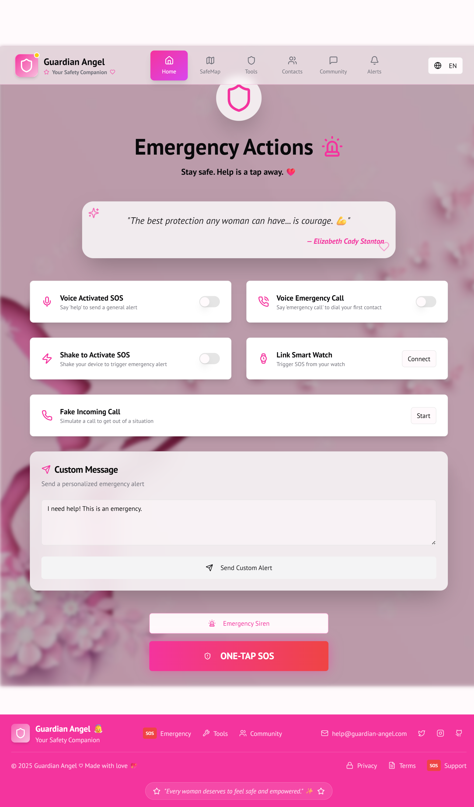
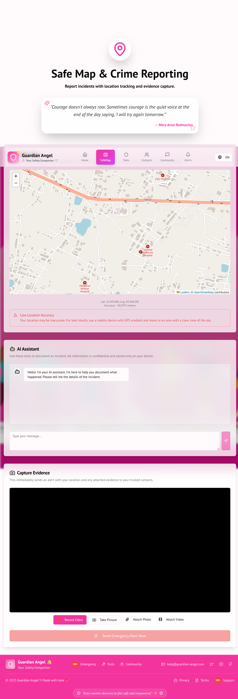
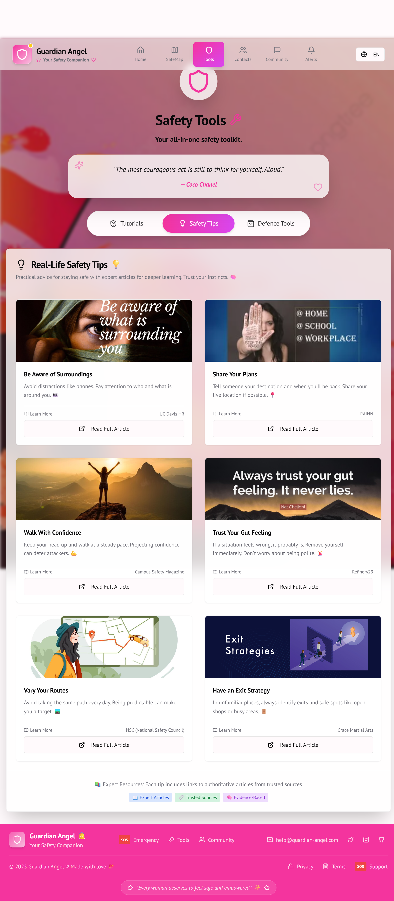
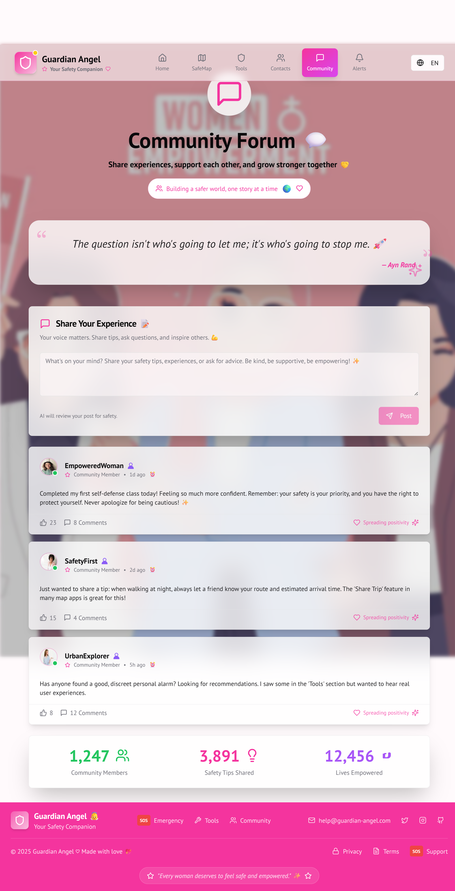

# 👼 Guardian Angel - Personal Safety Web App



> A modern safety companion designed especially for **women and students**, integrating **AI, real-time location, voice commands**, and **community-driven features** to ensure you never feel alone again.

---

## 📹 Demo Video

[(https://www.linkedin.com/posts/subhasmita-sahoo-puja_womensafety-womenintech-hackathonwinner-activity-7354529715925200898-1E2m?utm_source=social_share_send&utm_medium=member_desktop_web&rcm=ACoAAEH0n1oBtjwadIqgqk4TRDwqBhX_3JmDUsk)]

---

## 🚨 Features At A Glance

| 🚀 Feature | 💡 Description |
|-----------|----------------|
| 🆘 One-Tap SOS | Sends a message + live location via SMS |
| 🔊 Emergency Siren | Loud siren using Tone.js to deter threats |
| 🎙️ Voice-Activated SOS | Say “help” or “emergency call” to trigger alerts |
| 📳 Shake to SOS | Shake your device to send alerts instantly |
| 🎭 Fake Incoming Call | Simulate a real call to escape bad situations |
| 🌐 Live Safety Map | Community-rated safe & risky zones via Leaflet.js |
| 🤖 AI Crime Report Assistant | Calm, guided reporting with Gemini AI |
| 📷 Capture Evidence | Record photo/video & attach to reports |
| 📚 Tutorials & Tips | Self-defense lessons + curated safety tips |
| 🧑‍🤝‍🧑 Community Forum | Share stories, ask questions with moderation |
| 📇 Trusted Contacts | Manage emergency contact list securely |
| 📜 Alert History | See your full emergency log timeline |

---

## 🧠 Core Mission

> **"Empower users to feel secure and supported anytime, anywhere."**

Guardian Angel is not just an app—it's your personal safety companion that anticipates danger, assists in real-time, and documents it when necessary.

---

## 🌈 Screenshots

### 🗺️ Safety Map + Zone Ratings 🤖 AI Crime Assistant


### Tools Page


### Community Forum Page


### Contact Page


 ### Alerts Page

---

## 🛠️ Tech Stack

### ⚙️ Frontend:
- `React.js` + `Next.js 14`
- `Tailwind CSS` + `ShadCN UI`
- `Tone.js`, `Web Speech API`, `Device Motion API`

### 🌍 Real-Time & Browser APIs:
- `Geolocation API`, `MediaDevices`, `MediaRecorder`
- `Web Speech API`, `Device Motion`, `Tone.js`

### 🤖 AI & Backend:
- `Genkit` + Google’s `Gemini AI`
- Genkit Tools & Flows: Crime Assistant, Content Moderation, TTS Call
- Server Actions via `use server` (Next.js backend)
- Hosted on `Vercel App Hosting`

---

## 🌐 Internationalization (i18n)

- App supports **English**, **Hindi**, and **Odia**
- Managed via a custom `LanguageContext`

---

## 🧪 How to Run Locally

```bash
# Clone this repository
git clone https://github.com/yourusername/guardian-angel.git

# Go into the project folder
cd guardian-angel

# Install dependencies
npm install

# Run the development server
npm run dev

# Visit in browser
http://localhost:3000
```

---

## 📁 Folder Structure (Overview)

```
guardian-angel/
├── app/
│   ├── sos/
│   ├── map/
│   ├── report/
│   ├── learn/
│   ├── forum/
│   ├── contacts/
│   └── history/
├── components/
├── hooks/
├── lib/
├── public/
├── styles/
├── genkit/  # All AI workflows
└── apphosting.yaml
```

---

## ❤️ Special Thanks

- 🔮 [Google Genkit](https://github.com/google/genkit)
- 🧠 [Gemini AI](https://deepmind.google/technologies/gemini/)
- 🗺️ [Leaflet.js](https://leafletjs.com/)
- 🎵 [Tone.js](https://tonejs.github.io/)

---

## 📣 Contributing

We welcome PRs for new features, bug fixes, language translations, and more. Just fork the repo, make your changes, and open a pull request!

---

## 📜 License

This project is licensed under the [MIT License](LICENSE).

---
## 👩‍💻 About Me

Hi, I'm **Subhasmita Sahoo** — a passionate developer from Odisha, India. 💻
 🔒 I'm deeply interested in building apps that help and protect others.

📍 Khordha, Odisha  
📫 Email: subhasmita4602@gmail.com  
🔗 [LinkedIn](https://www.linkedin.com/in/subhasmita-sahoo-puja) |
[Github](https://github.com/subhasmita-puja)|
[Personal Portfolio](portfolio-iota-topaz-92.vercel.app/)

---

## 🧍‍♀️ Empowerment Starts with You!

> “Your voice is powerful. Your safety is non-negotiable. Guardian Angel is here for you.”

---

